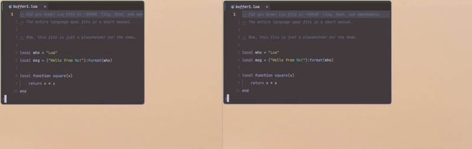

# 🪟 keep-split-ratio.nvim

Preserve split percentages on UI resize. If you have 70/30 or 50/50 vertical splits, resizing your terminal/editor resizes the splits proportionally.

- Lightweight. Does nothing until `VimResized` fires.
- Per-tab state.
- Respects `winfixwidth` columns (they keep their width).

## Install

### Lazy.nvim
```lua
{ "adlrwbr/keep-split-ratio.nvim", opts = {} }
```

## Demo

As we resize the window,

| Default | with `keep-split-ratio.nvim` |
| --- | --- |
| only the right side grows and shrinks | both splits grow and shrink



## See also

- [`winfixwidth` / `winfixheight`](https://neovim.io/doc/user/windows.html#'winfixwidth')  
  Mark a split as fixed (`:set winfixwidth`) so it resists being resized.  
  Useful for sidebars but the opposite of keeping ratios.

- Manual equalize  
  The keybind `<C-w>=` equalizes all splits on demand.

- [`equalalways`](https://neovim.io/doc/user/options.html#'equalalways')  
  `:set equalalways` or `vim.opt.equalalways = true`  
  Automatically equalizes splits whenever the window is resized or a new split is opened.

- [focus.nvim](https://github.com/nvim-focus/focus.nvim)  
  Full-fledged window manager: auto-resizing, focus mode, etc.

- [windows.nvim](https://github.com/anuvyklack/windows.nvim)  
  Automatic window sizing with focus animation.
